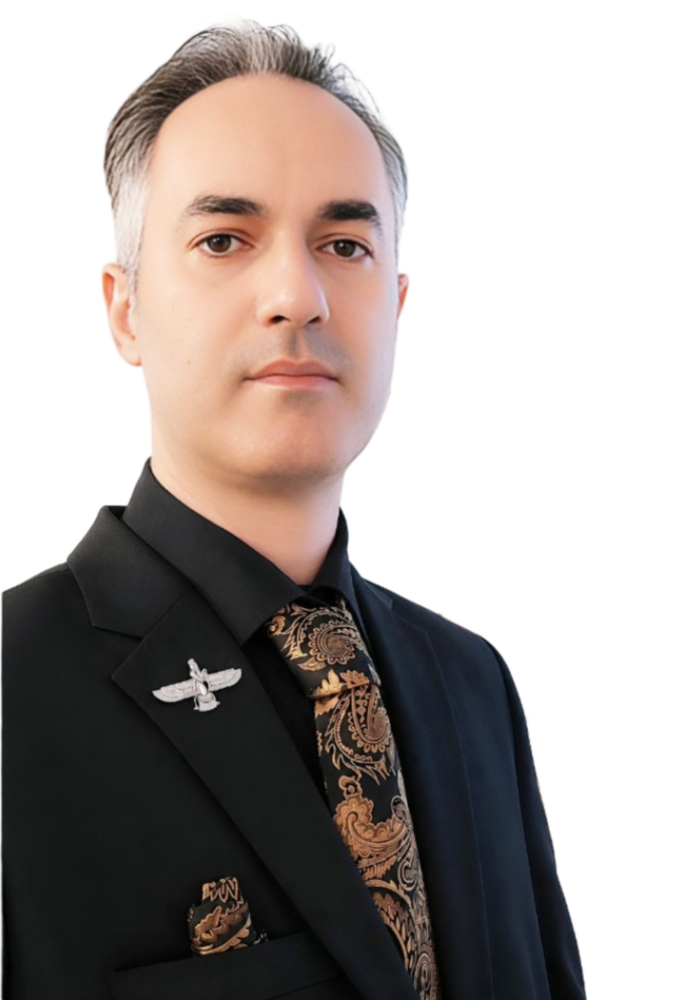
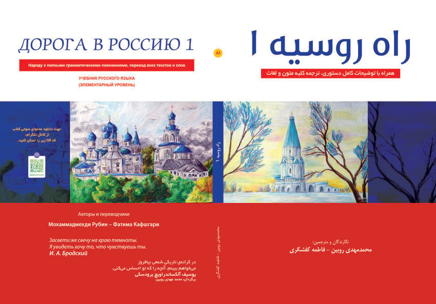
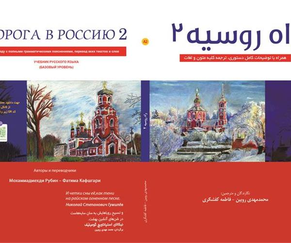

  

# Hi there, I'm Mohammadmahdi Rubin 👋  
# سلام، من محمدمهدی روبین هستم 👋

**Russian Language Educator | Author | Translator | Researcher | Curriculum Developer**  
**مدرس، مترجم، نویسنده و پژوهشگر زبان روسی**

With over **25 years** of professional experience in Russian language education and curriculum development.  
با بیش از **۲۵ سال** تجربه حرفه‌ای در آموزش زبان روسی و تدوین برنامه درسی.

---

### 👨‍🏫 About Me | درباره من

I am a Russian language educator, author, and translator based in Iran.  
My work focuses on creating high-quality educational materials and introducing Russian language and culture to Persian-speaking learners.

من مدرس، نویسنده و مترجم زبان روسی هستم. تمرکز من روی تولید منابع آموزشی باکیفیت و معرفی زبان و فرهنگ روسیه به زبان‌آموزان فارسی‌زبان است.

- Author of **20+ textbooks** on Russian language and culture  
- Translator and researcher in Russian literature, history, and society  
- Winner of International Russian Language Olympiads (Ulyanov University)  
- B.Sc. in Power Electrical Engineering  
- M.A. in Russian Language Teaching — University of Tehran  
- Member of the Iranian Writers’ Association and Iran Book & Literature House  

- نویسنده بیش از **۲۰ عنوان کتاب** آموزش زبان روسی و فرهنگ روسیه  
- مترجم و پژوهشگر ادبیات، تاریخ و جامعه روسیه  
- برنده المپیادهای بین‌المللی زبان روسی (دانشگاه اولیانوف)  
- کارشناسی مهندسی برق قدرت  
- کارشناس ارشد آموزش زبان روسی — دانشگاه تهران  
- عضو کانون نویسندگان سرای اهل قلم و خانه کتاب و ادبیات ایران  

---
### 📚 Selected Publications | گزیده‌ای از کتاب‌ها

<table>
  <tr>
    <td align="center" width="33%">
       
      <b>Road to Russia 1</b> 
      راه روسیه ۱
    </td>
    <td align="center" width="33%">
       
      <b>Road to Russia 2</b> 
      راه روسیه ۲
    </td>
    <td align="center" width="33%">
       
      <b>Path to Success 1</b> 
      راه موفقیت ۱
    </td>
  </tr>
  <tr>
    <td align="center">
       
      <b>Path to Success 2</b> 
      راه موفقیت ۲
    </td>
    <td align="center">
       
      <b>Encyclopedia of Russia</b> 
      دانشنامه روسیه
    </td>
    <td align="center">
       
      <b>Great Figures of Russian Literature</b> 
      مشاهیر ادبیات روسیه
    </td>
  </tr>
  <tr>
    <td align="center">
       
      <b>Culture of Russia</b> 
      فرهنگ روسیه
    </td>
    <td align="center">
       
      <b>Cities of Russia</b> 
      شهرهای روسیه
    </td>
    <td align="center">
       
      <b>Russian Orthodoxy</b> 
      مسیحیت ارتدوکس روسی
    </td>
  </tr>
  <tr>
    <td align="center">
       
      <b>Music of Russia</b> 
      موسیقی روسیه
    </td>
    <td align="center">
       
      <b>سخنان ناب</b> 
      سخنان ناب
    </td>
    <td align="center">
       
      <b>Russian Handwriting</b> 
      خط تحریری روسی
    </td>
  </tr>
  <tr>
    <td align="center">
       
      <b>Russian Reading 1</b> 
      روخوانی زبان روسی ۱
    </td>
    <td align="center">
       
      <b>Russian Reading 2</b> 
      روخوانی زبان روسی ۲
    </td>
    <td align="center">
       
      <b>Russian Reading 3</b> 
      روخوانی زبان روسی ۳
    </td>
  </tr>
  <tr>
    <td align="center">
       
      <b>Russian Reading 4</b> 
      روخوانی زبان روسی ۴
    </td>
    <td align="center">
       
      <b>Path to Success 1 - Workbook</b> 
      راه موفقیت ۱ - کتاب تمرین
    </td>
    <td align="center">
       
      <b>Path to Success 2 - Workbook</b> 
      راه موفقیت ۲ - کتاب تمرین
    </td>
  </tr>
</table>

| Title (English) | عنوان فارسی | Publisher | Year |
|------------------|-------------|-----------|------|
| Road to Russia 1 & 2 | راه روسیه ۱ و ۲ | Rahnama | 2023 |
| Path to Success 1 & 2 | راه موفقیت ۱ و ۲ | Rahnama | 2023–2024 |
| Russian Reading Series (1–4) | روخوانی زبان روسی (۱ تا ۴) | Rahnama | 2023 |
| Encyclopedia of Russia | دانشنامه روسیه | Rahnama | 2023 |
| Great Figures of Russian Literature | مشاهیر ادبیات روسیه | Rahnama | 2023 |
| Culture of Russia | فرهنگ روسیه | Rahnama | 2023 |
| Cities of Russia | شهرهای روسیه | Rahnama | 2022 |
| Russian Orthodoxy | مسیحیت ارتدوکس روسی | Rahnama | 2025 |
| Music of Russia | موسیقی روسیه | Rahnama | 2025 |
| Russian Handwriting | خط تحریری روسی | Rahnama | 2023 |

---

### 🎯 Current Focus | تمرکز فعلی

- Online Russian language instruction (A1–C1)  
- Developing new materials in the *Russia Studies* series  
- Translating and adapting educational content for Persian learners  

- تدریس آنلاین زبان روسی (سطوح A1 تا C1)  
- تألیف منابع جدید در مجموعه روسیه‌شناسی  
- ترجمه و بومی‌سازی محتوای آموزشی برای زبان‌آموزان فارسی‌زبان  

---

### 🌐 Connect with Me | راه‌های ارتباطی

- **Telegram**: [t.me/RussianLan](https://t.me/RussianLan)  
- **X (Twitter)**: [@SheraginRubin](https://x.com/SheraginRubin)  
- **LinkedIn**: [Mohammadmahdi Rubin](https://www.linkedin.com/in/mohammadmahdi-rubin)  
- **Email**: sheragin.r@gmail.com  

---

### 💡 Open to Collaboration | آماده همکاری

I am open to collaboration on educational content, translation projects (Russian ↔ Persian), curriculum design, and digital learning resources.

آماده همکاری در زمینه تولید محتوای آموزشی، پروژه‌های ترجمه (روسی ↔ فارسی)، طراحی برنامه درسی و منابع دیجیتال یادگیری هستم.

Feel free to reach out!  
خوشحال می‌شم در ارتباط باشیم.
